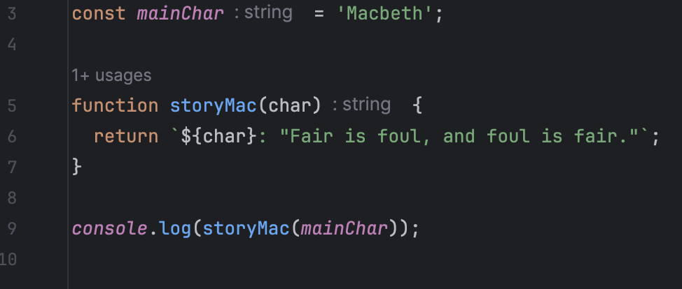

## Code Me A Story

A program never needs to look beautiful for it to do what you want it to do. As long as it gets the job done, you can call it a day, right? While it's true that code doesn't need to look the part, it works better if there is some backbone to keep dependencies in line, to allow functions to flow through the code without throwing warnings, and to keep redundant code from mucking up the runtime. I once had a professor tell the class that code should tell a story. There should be characters (variables) and events (functions) that help move the story (program) along in a way that makes sense. 

It wouldn't make sense for a story to invest time into defining a character just for that character to never show up again. It goes the same for variables in code. Likewise, for story driving events. A good story shouldn't have random or redundant events that contribute nothing. Code should follow similar principles: redundant or useless functions do nothing but slow your code down, even if it is only by a little. Simple structure like this can vastly improve code, especially as it expands to thousands of lines of code.

## What Can Storytelling Teach Us?

Implementing solid coding standards into your repertoire will undoubtedly be beneficial to the health of your code, but is there anything else it can provide to an aspiring software engineer? I believe that programming within a coding standard can offer insights into the intricacies of a particular programming language. Take clang-tidy for the C and C++ programming languages, for example. These programming linters, especially for new programmers, can be quite demanding. ESLint for Javascript and TypeScript code operates similarly to clang-tidy; it will pile on the errors and warnings even for small amounts of code. They will scrutinize every aspect of your code and throw warnings and errors that light up your compiler to make sure you abide by coding standards. Can it be frustrating? Most likely. However, all of this can help you understand the language a little better. Writing within the guidelines of a coding standard not only teaches you what **not** to do, but it also highlights habits that make you a **better** programmer.

## A Message From the Author

From personal experience with both clang-tidy and ESLint, I can say that it is a headache when trying to adhere to such strict guidelines while coding. However, as it was mentioned earlier, it helps stimulate my growth as a programmer. Each avoided warning and every error that is fixed is a step forward in understanding the language. Most recently, I started to use the IntelliJ IDE alongside ESLint to develop Github repositories, locally. After using the development environment and the linter for about a week, I have grown to appreciate them. Albeit, I am still fairly new to them, I find similarities to previous projects that I have worked on using CLion and clang-tidy. If I were learning to program and this was one of my first experiences setting up my own IDE and linter, then maybe I would've found it to be frustrating or overwhelming. Since I have previous experience with IDE's and working with a linter, I actually find it to be fun and rewarding to develop clean and functional code, at least for now.
