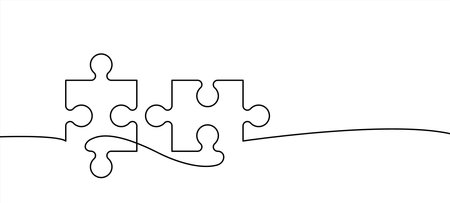

## Like Pieces of a Puzzle
A puzzle with an arbitrary number of pieces, with each piece being a blank canvas, waiting for someone to bring it life. Where do you even begin? Perhaps you can find all the edges and build your foundation there, slowly working inward as each step culminates into the final masterpiece. This is the software development life cycle, or one way to interpret it at the very least. 
