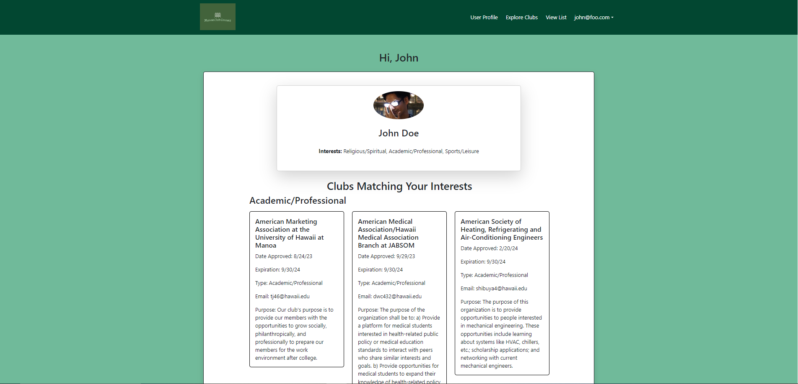
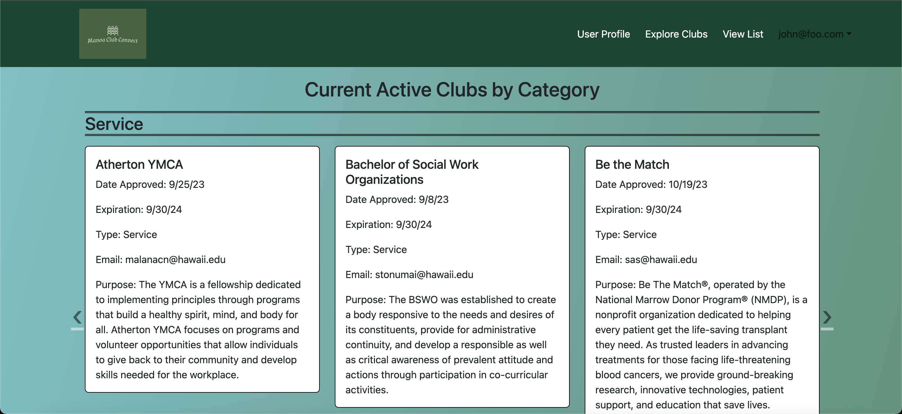

## Overview
The University of Hawai'i at Manoa has a wide range of over 200 clubs and organizations available to members of the UH community, however there is no convenient way for them to view or access these clubs online. To remedy this, I, alongside four other developers, created Manoa Club Connect. The Manoa Club Connect project is a web application meant to bridge this gap, allowing those who are apart of the UH community to view the different clubs as well as personalize what type of clubs suit their interests. Users are also able to view the raw list of clubs in alphabetical order as well as look at the clubs by their category. Each club also has a description or purpose that users can read to see if they are interested. The key pages implemented in the website are the landing page, the user profile page, and explore clubs page. These pages are displayed below:

### Landing Page

### User Profile Page

### Explore Clubs Page

Manoa Club Connect also features an admin role for those responsible for maintaining the current information for their clubs. A top-level admin role is also issued to the developers of the website, where we moderate all the clubs currently in the database and has the authority to add new clubs as well as remove clubs with expired approval dates. 

## Contributions
As one of the developers involved in this project, I handled both front-end and back-end issues. Tasks such as creating the landing page, the admin and top-level admin roles and accounts within the database, allowing clubs to be added and edited by the respective roles, as well as creating tests that check the functionality of each page on commits. I also created the styling for a lot of the UI, making the website more appealing to users. Controlling the database through Studio3T as well as tracking the traffic through the website with MontiAPM were also apart of my responsibilities. Deploying Manoa Club Connect to a secure domain through DigitalOcean as well as keeping the deployed application updated was another responsibility that I managed. Collaborating with my fellow developers as well as managing what tasks needed to be done were also a key aspect in developing the website.

## Key Takeaways
This experience has taught me a lot about the fundamentals of being a software engineer. Professionals must be able to work efficiently in teams as that is the most beneficial way to successfully produce a project of such scale. The use of Agile Project Management, specifically Issue Driven Project Management, brings a structure and organization that allows us to identify smaller tasks that need to be completed, which accumulates in the production of a well developed application or product. I feel like I also gained leadership experience since I managed and delegated a lot of the issues to my fellow developers, increasing our efficiency and helping us produce a finished product in a timely manner. I also gained an understanding of how important coding standards are when working in a group where code can clash with each other. Since we were using Github, there were times where commits and branch merges either broke the website or were not allowed due to inconsistencies between the versions. This meant that we would have to go through the failed builds and search for the errors. By struggling through these obstacles, I was able to develop critical problem solving skills for issues I've never encountered before. 

For more information, visit the [Code Autonomy](https://github.com/code-autonomy) organization page on Github.
* [Documentation](https://code-autonomy.github.io/)
* [Source Code](https://github.com/code-autonomy/manoa-club-connect)
