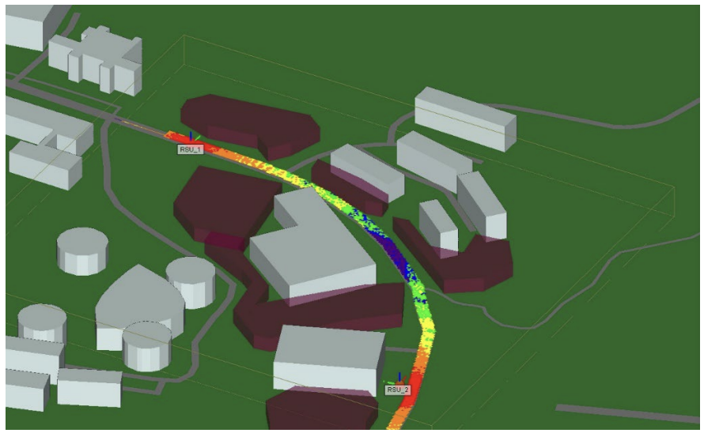

_Simulated traffic congestion_

Monet is a project team based out of the University of Hawai'i at Manoa, aiming to design a millimeter-wave communication system with integrated radar sensing capabilities to allow applications including autonomous vehicles. Since the project is run by the University, both undergraduate students and graduate students worked alongside under the supervision of a professor, who in this case was Professor Yao Zheng.

As an undergraduate at the time, I worked with other undergraduates to assist one of the graduate students design his portion of the project. My contribution was designing and running simulations of random traffic scenarios along Dole Street using SUMO, an open source software for simulating urban traffic. Throughout the Fall semester I designed multiple simulations, which assisted in the graduate students progress in finding optimal spots to place antennas to test antenna-to-car communications along Dole.

Through this project I was able to gain experience using the SUMO software to design and implement different simulations of traffic. I was also able to develop stronger teamwork skills, specifically when working in the techincal field.

The project is currently still being worked on. More information can be found [here](https://manoa.hawaii.edu/uh-vip/project/monet/).
